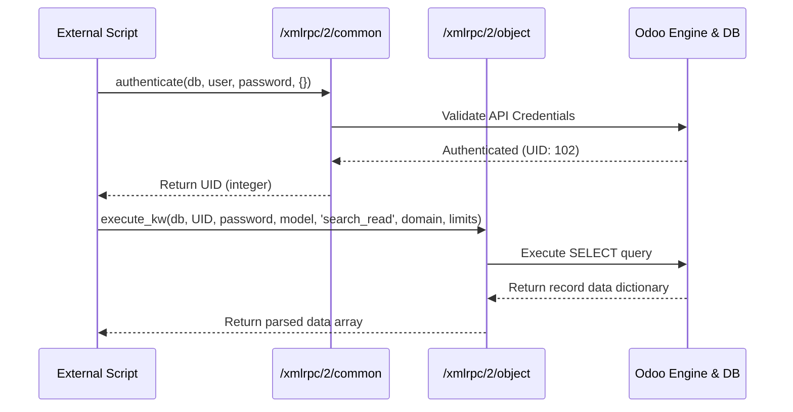

# External API: Connecting via XML-RPC & JSON-RPC

Odoo provides a secure, language-agnostic interface that allows external scripts, legacy software, and third-party web apps to execute CRUD operations on any Odoo model.

---

## 1. What is it
Odoo exposes a robust **XML-RPC** (and JSON-RPC) endpoint interface. These protocol services allow developers to execute Odoo object methods remotely using standard HTTP/S procedures. Odoo segments API routing into two endpoints:
*   `/xmlrpc/2/common`: For user session authentication.
*   `/xmlrpc/2/object`: For record querying and transaction operations.

---

## 2. Why
Modern business software runs in environments with multiple applications (e.g. external e-commerce sites, BI reporting, or warehousing legacy databases). Exposing Odoo’s ORM dynamically through standard APIs enables integration with any language (Python, Node.js, PHP, Java, or C#).

---

## 3. When
*   Use to feed sales orders from external shopping carts directly into Odoo.
*   Use to sync customer records with external marketing lists.
*   Use to extract warehouse quantities for shipping managers.

---

## 4. When Not
*   **Do not** call External APIs inside local custom Odoo modules to communicate with the same database (use Odoo’s native `env` model calls).
*   **Do not** use plain HTTP (`http://`) to send XML-RPC payloads in production as credential arguments are passed in clear text. Always encrypt queries using HTTPS (`https://`).

---

## 5. Syntax
The API uses Python’s built-in `xmlrpc.client` library (or similar XML-RPC clients in other languages). 

```python
import xmlrpc.client

# 1. Establish common helper service proxy
common = xmlrpc.client.ServerProxy('https://my-odoo.com/xmlrpc/2/common')

# 2. Authenticate credentials to retrieve User ID (UID)
uid = common.authenticate('db_name', 'username', 'api_key', {})

# 3. Establish object helper service proxy
models = xmlrpc.client.ServerProxy('https://my-odoo.com/xmlrpc/2/object')

# 4. Call model methods remotely
result = models.execute_kw(
    'db_name', uid, 'api_key',
    'model.name', 'method_name',
    args_list, kwargs_dict
)
```

---

## 6. Examples

### A. Step 1: Authentication Connection Script
```python
import xmlrpc.client

url = 'https://odoo19-masterclass.odoo.com'
db = 'auction_db'
username = 'integration_user'
password = 'your_user_api_key'  # Use API Keys, not passwords!

common = xmlrpc.client.ServerProxy(f'{url}/xmlrpc/2/common')
uid = common.authenticate(db, username, password, {})

if uid:
    print(f"✅ Connection successful! User ID: {uid}")
else:
    print("❌ Authentication failed.")
```

### B. Step 2: Search & Read (Efficient Filtering)
```python
models = xmlrpc.client.ServerProxy(f'{url}/xmlrpc/2/object')

# Fetch name and starting price for up to 5 open auctions
listings = models.execute_kw(
    db, uid, password, 
    'auction.listing', 'search_read',
    [[('state', '=', 'open')]],  # Domain filter
    {
        'fields': ['name', 'starting_bid', 'end_date'],  # Specific fields
        'limit': 5                                      # Limit rows
    }
)

for item in listings:
    print(f"Listing: {item['name']} | Starting Bid: {item['starting_bid']}")
```

### C. Step 3: Remote Record Creation
```python
# Create a new bid record remotely
new_bid_id = models.execute_kw(
    db, uid, password,
    'auction.bid', 'create',
    [{
        'listing_id': 12,
        'bidder_id': 45,
        'amount': 5500.00
    }]
)
print(f"Created Bid ID: {new_bid_id}")
```

---

## 7. Common Mistakes
1.  **Chaining single API writes in loops**: Running loop structures in external scripts to call `create` or `write` sequentially. This is highly inefficient due to web server latency. Always batch records and write them in a single call.
2.  **Hardcoding Raw User Passwords**: Hardcoding a user's active login password inside external scripts. If a password is changed, the script crashes. Always generate and configure **API Keys** via *Settings > Users > Account Security*.

---

## 8. Performance
*   **search_read Efficiency**: Never query using `search` to get IDs, and then call `read` in a separate API loop. This doubles network latency. Always use `search_read` to combine the steps in a single execution round-trip.
*   **Web Worker Threads**: API requests occupy HTTP worker threads. High-frequency external polling can saturate system workers, blocking standard browser users.

---

## 9. Senior
In Odoo 19:
*   **Security Best Practices**: Create dedicated, restricted user accounts (e.g. "API Sync User") with minimal access groups (ACLs) to ensure external scripts cannot view confidential accounting or employee fields.
*   **Python wrappers**: Use library engines like [OdooRPC](https://pythonhosted.org/OdooRPC/) or [ERPEek](https://github.com/nantic/erpeek) which wrap the raw xmlrpc methods into standard Pythonic model classes.

---

## 10. Diagrams

This sequence diagram illustrates the external authentication handshake and subsequent data fetching query pipeline:



---

## 11. Related
*   [Controllers & Web](controllers.md)
*   [SQL Performance](performance.md)
*   [Recordset Helpers](../env/recordset_helpers.md)
