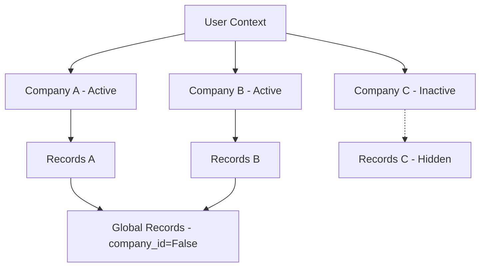

# Multi-Company Logic

Odoo is designed to handle multiple companies within a single database. This allows for centralized management of different legal entities, branches, or franchises.

---

## The `company_id` Field

To make a model multi-company aware, you must add a `company_id` field. By convention, this field is used to filter records so users only see data for their currently active company.

### Basic Implementation
```python
class AuctionListing(models.Model):
    _name = 'auction.listing'
    
    name = fields.Char(string="Title", required=True)
    company_id = fields.Many2one(
        'res.company', 
        string='Company', 
        default=lambda self: self.env.company, # Sets default to user's current company
        required=True
    )
```

!!! warning "Security Check"
    Adding the field is not enough! You must also define **Record Rules** in `security/ir.model.access.csv` or `security/security.xml` to enforce that users can only see records belonging to their companies.

---

## Multi-Company Record Rules

A standard multi-company rule usually looks like this in XML:

```xml
<record id="auction_listing_multi_company_rule" model="ir.rule">
    <field name="name">Auction Listing Multi-Company</field>
    <field name="model_id" ref="model_auction_listing"/>
    <field name="domain_force">
        ['|', ('company_id', '=', False), ('company_id', 'in', allowed_company_ids)]
    </field>
</record>
```

### Key Terms:
- **`allowed_company_ids`**: A special context variable containing the IDs of all companies the user has selected in their company switcher (top-right corner).
- **`('company_id', '=', False)`**: Allows records that are "Global" (shared across all companies).

---

## Using `with_company()`

Sometimes, code needs to run as if it belongs to a specific company (e.g., to fetch the correct sequence or use a specific tax rule). In Odoo 13+, we use the `with_company()` context manager.

### Python Example
```python
def process_auction(self):
    for record in self:
        # Switch context to the record's company
        # This ensures environment variables like self.env.company are updated
        record_with_company = record.with_company(record.company_id)
        
        # Now, any logic inside this block uses 'record.company_id'
        print(f"Current Environment Company: {record_with_company.env.company.name}")
```

!!! info "Avoid sudo()"
    `with_company()` is safer than `sudo()`. It changes the *company* context without granting full admin privileges, maintaining better security.

---

## Multi-Company Hierarchy Diagram



---

## Summary Table

| Tool | Usage | Purpose |
| :--- | :--- | :--- |
| **`self.env.company`** | Python | Get the *primary* company selected by the user. |
| **`self.env.companies`**| Python | Get *all* companies currently active in the UI. |
| **`allowed_company_ids`**| XML Domain| Filter records based on active UI selection. |
| **`with_company(id)`** | Python | Temporarily switch the execution context to a specific company. |

---

## 🏁 Senior Checkpoint
*   **Key Concept:** `company_id` is the anchor for multi-company isolation.
*   **Architect Insight:** Use `allowed_company_ids` in Record Rules to support the modern multi-company "switcher" where users can view multiple entities at once.
*   **Verify Your Knowledge:** How do you temporarily run code as a different company? (Answer: Using `self.with_company(company_id)`).

!!! success "Next Step"
    Backend is done. Let's build the [Modern Frontend](../frontend/owl.md) using OWL 2.0.

---

<div class="feedback-container">
    <span class="feedback-label">Was this page helpful?</span>
    <div class="feedback-buttons">
        <button class="feedback-btn" onclick="sendFeedback(true)">👍 Yes</button>
        <button class="feedback-btn" onclick="sendFeedback(false)">👎 No</button>
    </div>
</div>
