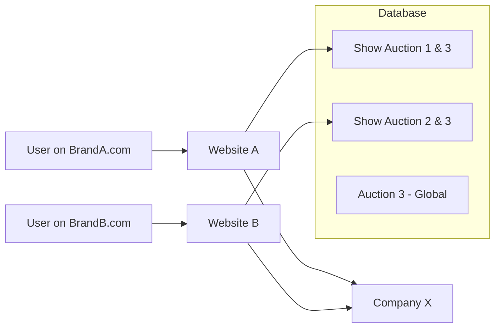

# Multi-Website Support

Odoo allows you to host multiple websites (different domains, themes, and content) on a single database. This is critical for businesses with multiple brands.

---

## Making Models "Website Aware"

To allow a record (like an Auction Listing) to be specific to one website, you must add the `website_id` field.

### Implementation
```python
class AuctionListing(models.Model):
    _name = 'auction.listing'
    _inherit = ['website.published.mixin'] # Optional: adds 'is_published' logic

    name = fields.Char(string="Title")
    website_id = fields.Many2one('website', string='Website')
```

### Why use `website_id`?
1. **Filtering**: Show different products on `site-a.com` vs `site-b.com`.
2. **Branding**: Link specific auctions to a specialized "Luxury" website.
3. **SEO**: Different websites can have different SEO configurations for the same model type.

---

## Multi-Website Logic in Controllers

When writing a website controller, you often need to filter data based on the website the user is currently browsing.

### Automatic Filtering
Odoo's `website` module automatically provides a `request.website` object in the controller context.

```python
from odoo import http
from odoo.http import request

class AuctionController(http.Controller):
    
    @http.route('/auctions', auth='public', website=True)
    def list_auctions(self, **kwargs):
        # request.website is automatically set based on the URL domain
        current_website = request.website
        
        # Filter auctions for the current website OR global auctions
        auctions = request.env['auction.listing'].search([
            '|', 
            ('website_id', '=', False), 
            ('website_id', '=', current_website.id)
        ])
        
        return request.render('pways_auction.index_template', {
            'auctions': auctions
        })
```

!!! tip "The `website=True` Argument"
    Always include `website=True` in your `@http.route` decorator. This ensures the routing system identifies the current website and initializes the `request.website` object.

---

## Multi-Website vs Multi-Company

While they are related, they serve different purposes:

| Feature | Multi-Company | Multi-Website |
| :--- | :--- | :--- |
| **Target** | Legal/Internal structure. | Marketing/External branding. |
| **Logic** | Linked to `res.company`. | Linked to `website`. |
| **Data Scope**| Accounting, Inventory, HR. | Products, Blogs, Pages, Themes. |

!!! info "Hierarchy"
    A **Website** always belongs to one **Company**. However, a **Company** can have multiple **Websites**.

---

## Multi-Website Routing Diagram



---

## Best Practices
1. **Defaulting**: If your model is mostly global, keep `website_id` optional (nullable).
2. **Published Mixin**: Inherit `website.published.mixin` to get standard "Publish on Website" buttons in the backend.
3. **Security**: Use Record Rules to ensure portal users only see records for the website they are browsing.

---

<div class="feedback-container">
    <span class="feedback-label">Was this page helpful?</span>
    <div class="feedback-buttons">
        <button class="feedback-btn" onclick="sendFeedback(true)">👍 Yes</button>
        <button class="feedback-btn" onclick="sendFeedback(false)">👎 No</button>
    </div>
</div>
