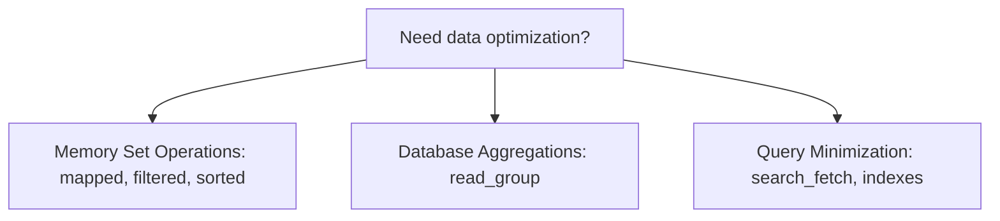

# Odoo 19: Performance Optimization

At scale, application performance separates junior developers from senior architects. The primary source of lag in Odoo is database bottlenecks and inefficient recordset processing. 

To optimize performance, you must use Odoo's built-in memory manipulation helpers (`mapped`, `filtered`, `sorted`), database aggregates (`read_group`), optimized queries (`search_fetch`), and indexing keys.



---

## 1. Memory Set Operations: `mapped()`, `filtered()`, `sorted()`

Never write manual loops to extract, filter, or sort field values. Odoo's built-in recordset methods run on highly optimized C-extensions and utilize Odoo's prefetching cache to prevent query loops.

### A. Extracting Data: `mapped()`
`mapped()` extracts a list of values (or a new recordset if it's a relational field) from the current recordset. You can pass a dot-separated string path or a custom lambda function.

```python
# ❌ Junior: Loop and append
seller_ids = []
for listing in listings:
    seller_ids.append(listing.seller_id.id)

# ✅ Senior: Single mapped call (uses environment prefetch cache)
seller_ids = listings.mapped('seller_id.ids')
```

### B. Filtering Records: `filtered()`
`filtered()` returns a subset of the recordset containing only the records that satisfy the filter condition. You can pass a string domain or a custom logic function.

```python
# ❌ Junior: Loop and check
active_listings = []
for listing in listings:
    if listing.state == 'active':
        active_listings.append(listing)

# ✅ Senior: Filtered with lambda
active_listings = listings.filtered(lambda r: r.state == 'active')

# ✅ Senior: Filtered with standard domain (faster & cleaner)
active_listings = listings.filtered_domain([('state', '=', 'active')])
```

### C. Sorting Records: `sorted()`
`sorted()` returns a sorted copy of the recordset. You can pass a field name string, a sorting order, or a sorting function.

```python
# Sort listings by highest price first, then by name ascending
sorted_listings = listings.sorted(key='price', reverse=True)
```

---

## 2. Database Aggregations: `read_group()`

Never fetch thousands of records to perform mathematical calculations (like sums, averages, or counts) in Python. Instead, push the execution to PostgreSQL using `read_group()`, which executes an optimized `GROUP BY` SQL query and returns a list of dictionaries.

```python
# Group bids by listing, summing amount and counting records
# Returns: [{'listing_id': (1, 'Vintage Rolex'), 'amount': 15000.0, 'listing_id_count': 12}, ...]
bid_stats = self.env['auction.bid'].read_group(
    domain=[('state', '=', 'active')],
    fields=['amount:sum'],
    groupby=['listing_id']
)
```

---

## 3. High-Performance Querying: `search_fetch()` [New in v19]

Traditional `search()` only queries record IDs. When you later read a field, Odoo executes a second SQL `SELECT` to fetch it.

**`search_fetch()`** resolves this by executing the search and retrieving target fields in **a single SQL query**, pre-loading them into the cache. This is the ultimate tool for preventing N+1 loop queries in dashboards and reports.

```python
# Performs: SELECT id, name, price FROM auction_listing WHERE state = 'active'
listings = self.env['auction.listing'].search_fetch(
    domain=[('state', '=', 'active')],
    field_names=['name', 'price']
)

# Zero database hits inside this loop because fields are preloaded
for listing in listings:
    print(f"{listing.name}: ${listing.price}")
```

---

## 4. Field Indexing: `index=True`

Database indexes are critical for keeping search speeds fast. Without indexes, PostgreSQL must perform sequential table scans (Seq Scan), reading every row from disk.

To index a field, add `index=True` to the Python field definition:

```python
# Creates a B-tree index on this column in PostgreSQL
reference_code = fields.Char("Reference Code", index=True)
```

### Indexing Rules:
*   **Do Index**: Fields frequently used in search domains (e.g. `[('code', '=', val)]`), join columns (`Many2one` fields), and sorting keys.
*   **Do Not Index**: Fields with high write/update frequencies or fields that are rarely searched (e.g. descriptions, phone numbers). Every index slows down writes (`create` and `write`) because PostgreSQL must rebuild the index structure.

---

## 🏁 Senior Checkpoint

*   **Key Concept**: Performance optimization is multi-layered: use `mapped/filtered/sorted` for in-memory manipulations, `read_group` for database-level aggregates, `search_fetch` to bypass N+1 loops, and `index=True` to speed up database scans.
*   **Architect Insight**: In-memory operations like `filtered()` are fine for small sets, but if you are handling thousands of rows, filter them *before* fetching from PostgreSQL by tuning your `search()` domain.
*   **Verify Your Knowledge**: When should you use `read_group()` instead of `search()`? (Answer: When you need to display aggregated stats like sums or counts for groups of records, as `read_group` calculates them inside PostgreSQL instead of transferring all row records to Python memory).
