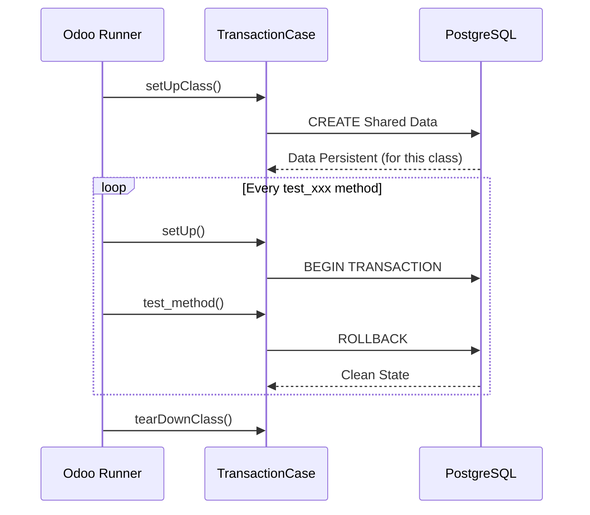

# Odoo 19 Unit Testing: Masterclass

In Odoo, unit tests are the backbone of a stable enterprise application. They ensure that business logic remains correct as the codebase evolves. Odoo 19 continues to leverage `unittest` with specialized classes like `TransactionCase`.

## The TransactionCase Class



`TransactionCase` is the most common test class in Odoo. Each test method runs in its own transaction, which is rolled back after execution, ensuring a clean state for every test.

### Basic Structure

```python title="tests/test_auction_listing.py"
from odoo.tests.common import TransactionCase

class TestAuctionListing(TransactionCase):
    @classmethod
    def setUpClass(cls):
        super().setUpClass()
        # Create common data once for all test methods
        cls.seller = cls.env['res.users'].create({
            'name': 'Verified Seller',
            'login': 'seller@example.com',
        })
        cls.listing = cls.env['auction.listing'].create({
            'name': 'Vintage Watch',
            'seller_id': cls.seller.id,
            'initial_price': 100.0,
        })

    def test_initial_state(self):
        """ Verify the default state of a new listing """
        self.assertEqual(self.listing.state, 'draft')
        self.assertEqual(self.listing.bid_count, 0)
```

!!! tip "Senior Tip: Data Isolation"
    Always use `setUpClass` for data that is shared across all tests in the class. It significantly improves performance by reducing database hits. Use `setUp` (without classmethod) only if you need a fresh record per test method.

---

## Mocking and Patching

Sometimes you need to simulate external services or bypass complex logic. Odoo uses the standard `unittest.mock` library.

### Mocking Example

```python title="tests/test_auction_external.py"
from unittest.mock import patch

def test_external_api_call(self):
    with patch('odoo.addons.pways_auction.models.auction_listing.ExternalService.call') as mocked_call:
        mocked_call.return_value = {'status': 'success'}
        result = self.listing.validate_externally()
        self.assertTrue(result)
        mocked_call.assert_called_once()
```

---

## Testing Exceptions with `assertRaises`

Testing that your code fails correctly is just as important as testing that it succeeds. Use `with self.assertRaises` to catch expected exceptions.

```python title="tests/test_auction_bid.py"
from odoo.exceptions import ValidationError

def test_invalid_bid_amount(self):
    """ Ensure a bid lower than the current price raises an error """
    with self.assertRaises(ValidationError), self.cr.savepoint():
        self.env['auction.bid'].create({
            'listing_id': self.listing.id,
            'amount': 50.0,  # Less than initial_price 100.0
        })
```

!!! warning "Note on Savepoints"
    When using `assertRaises` inside a `TransactionCase`, always wrap the call in `self.cr.savepoint()`. This prevents the "Transaction broken" error from spilling over into subsequent tests.

---

## Why Testing Matters for CI/CD

1. **Regression Prevention:** Automatically detect if new changes break existing features.
2. **Refactoring Confidence:** Safely optimize code knowing the behavior is locked by tests.
3. **Automated Documentation:** Tests serve as executable examples of how the system is intended to work.
4. **Faster Delivery:** Integrated into CI/CD pipelines (like GitHub Actions or Odoo.sh), tests allow for continuous deployment with high confidence.

!!! tip "Senior Tip: Coverage"
    Aim for 80%+ coverage on business logic models. Don't waste time testing Odoo's core framework; focus on your custom `@api.depends`, `@api.constrains`, and action methods.

---

## 🏁 Senior Checkpoint
*   **Key Concept:** `TransactionCase` ensures each test method runs in a dedicated transaction that is rolled back.
*   **Architect Insight:** Use `setUpClass` to create shared test data once; it saves minutes of execution time in large test suites.
*   **Verify Your Knowledge:** Why should you wrap `assertRaises` in `self.cr.savepoint()`? (Answer: To prevent a "broken transaction" error from affecting subsequent tests in the same suite).

!!! success "Next Step"
    Unit tests are solid. Now master [UI Tours](tours.md) to test your frontend.

---

## 🛠️ Master Project Challenge: Bulletproof Bids
We can't afford bugs in the bidding logic.

**Goal:** Write a test case in `TransactionCase`.
1.  Create a test auction listing in `setUpClass`.
2.  Write a test that attempts to place a bid **lower** than the starting price.
3.  Verify that it raises a `ValidationError` using `assertRaises`.

??? success "Show Solution"
    ```python title="tests/test_auction.py"
    from odoo.tests.common import TransactionCase
    from odoo.exceptions import ValidationError

    class TestAuctionBidding(TransactionCase):
        @classmethod
        def setUpClass(cls):
            super().setUpClass()
            cls.listing = cls.env['auction.listing'].create({
                'name': 'Vintage Lamp',
                'current_price': 50.0,
            })

        def test_invalid_low_bid(self):
            """Test that placing a bid lower than current price raises ValidationError."""
            with self.assertRaises(ValidationError), self.cr.savepoint():
                self.env['auction.bid'].create({
                    'listing_id': self.listing.id,
                    'amount': 20.0,
                })
    ```

---

<div class="feedback-container">
    <span class="feedback-label">Was this page helpful?</span>
    <div class="feedback-buttons">
        <button class="feedback-btn" onclick="sendFeedback(true)">👍 Yes</button>
        <button class="feedback-btn" onclick="sendFeedback(false)">👎 No</button>
    </div>
</div>
