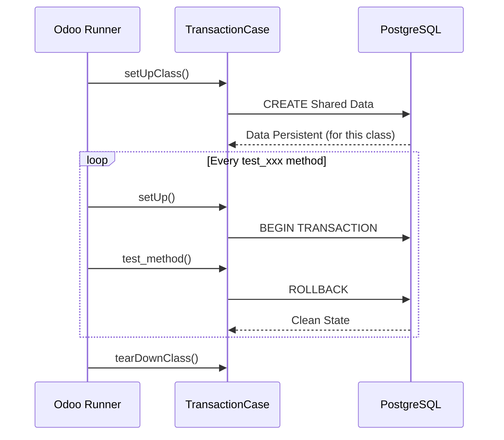

# Odoo 19 Unit Testing: Masterclass

In Odoo, unit tests are the backbone of a stable enterprise application. They ensure that business logic remains correct as the codebase evolves. Odoo 19 continues to leverage `unittest` with specialized classes like `TransactionCase`.

## The TransactionCase Class



`TransactionCase` is the most common test class in Odoo. Each test method runs in its own transaction, which is rolled back after execution, ensuring a clean state for every test.

### Basic Structure

```python title="tests/test_auction_listing.py"
from odoo.tests.common import TransactionCase

class TestAuctionListing(TransactionCase):
    @classmethod
    def setUpClass(cls):
        super().setUpClass()
        # Create common data once for all test methods
        cls.seller = cls.env['res.users'].create({
            'name': 'Verified Seller',
            'login': 'seller@example.com',
        })
        cls.listing = cls.env['auction.listing'].create({
            'name': 'Vintage Watch',
            'seller_id': cls.seller.id,
            'initial_price': 100.0,
        })

    def test_initial_state(self):
        """ Verify the default state of a new listing """
        self.assertEqual(self.listing.state, 'draft')
        self.assertEqual(self.listing.bid_count, 0)
```

!!! tip "Senior Tip: Data Isolation"
    Always use `setUpClass` for data that is shared across all tests in the class. It significantly improves performance by reducing database hits. Use `setUp` (without classmethod) only if you need a fresh record per test method.

---

## 2. Specialized Test Classes: Choosing Your Base

Selecting the correct test base class determines how Odoo isolates transactions and what resources (like a headless Chrome browser) are allocated for the tests:

### A. `TransactionCase` (The Industry Standard)
*   **Best For**: 90% of business logic tests (actions, computes, constraints).
*   **Transaction Isolation**: Executes the `setUpClass()` data creation in a global class transaction, then wraps every single test method in a savepoint transaction that is automatically **rolled back** at completion.
*   **Database Impact**: Guarantees a clean database state for subsequent tests.

### B. `SavepointCase` (Legacy)
*   **History**: In legacy Odoo versions (v12-v14), `SavepointCase` was used to optimize test speeds by creating data once in `setUpClass()` under a single database savepoint, while `TransactionCase` recreated data for every test method.
*   **Odoo 19 Shift**: `TransactionCase` has been refactored to perform the exact same class-level savepoint optimizations. As a result, `SavepointCase` is deprecated in Odoo 19, and you should always inherit from `TransactionCase` for standard unit tests.

### C. `HttpCase` (Web Clients & Tours)
*   **Best For**: Web controllers, XML-RPC APIs, website routes, and headless browser tests (OWL Javascript tours).
*   **Headless Browser**: Allocates a Chrome browser instance (`self.browser`) to load pages, simulate clicks, and test Javascript behaviors.
*   **Security & Sessions**: Provides helpers like `self.authenticate(login, password)` to simulate user sessions.
*   **Transaction Isolation**: Because it triggers requests over HTTP, it runs in a separate database transaction thread and **does not rollback** by default unless explicitly configured.

```python
from odoo.tests import HttpCase

class TestAuctionWeb(HttpCase):
    def test_listing_page(self):
        # Authenticate as user
        self.authenticate('admin', 'admin')
        # Open public endpoint
        response = self.url_open('/auction/listings')
        self.assertEqual(response.status_code, 200)
```

---

## 3. Mocking and Patching

Sometimes you need to simulate external services or bypass complex logic. Odoo uses the standard `unittest.mock` library.

### Mocking Example

```python title="tests/test_auction_external.py"
from unittest.mock import patch

def test_external_api_call(self):
    with patch('odoo.addons.pways_auction.models.auction_listing.ExternalService.call') as mocked_call:
        mocked_call.return_value = {'status': 'success'}
        result = self.listing.validate_externally()
        self.assertTrue(result)
        mocked_call.assert_called_once()
```

---

## Testing Exceptions with `assertRaises`

Testing that your code fails correctly is just as important as testing that it succeeds. Use `with self.assertRaises` to catch expected exceptions.

```python title="tests/test_auction_bid.py"
from odoo.exceptions import ValidationError

def test_invalid_bid_amount(self):
    """ Ensure a bid lower than the current price raises an error """
    with self.assertRaises(ValidationError), self.cr.savepoint():
        self.env['auction.bid'].create({
            'listing_id': self.listing.id,
            'amount': 50.0,  # Less than initial_price 100.0
        })
```

!!! warning "Note on Savepoints"
    When using `assertRaises` inside a `TransactionCase`, always wrap the call in `self.cr.savepoint()`. This prevents the "Transaction broken" error from spilling over into subsequent tests.

---

## Odoo 19 Test Runner CLI Command Reference

To execute unit tests in Odoo 19, you use the standard Odoo command-line binary (`odoo-bin`). You must combine flags to configure test execution environment, database targets, and target filters.

### Core CLI Testing Flags

| Flag | Purpose | Example |
| :--- | :--- | :--- |
| **`--test-enable`** | Globally enables Odoo's test runner engine. If not provided, tests are completely ignored. | `--test-enable` |
| **`--test-tags <tags>`** | Specifies exactly which tests to execute based on path or tags. | `--test-tags /pways_auction` |
| **`-i <modules>`** | Installs target modules (triggers tests registered under the `at_install` tag). | `-i pways_auction` |
| **`-u <modules>`** | Updates target modules (re-runs tests during upgrade cycles). | `-u pways_auction` |
| **`--stop-after-init`** | Shuts down the Odoo server immediately once tests complete. Essential for CI/CD pipelines. | `--stop-after-init` |
| **`--log-level`** | Suppresses general logs to make test failures readable. Recommended values: `test` or `warn`. | `--log-level=test` |

---

### Copy-Pasteable Run Command Templates

#### A. Run All Tests for a Module (On Install/Update)
This command installs the module, executes its tests, and stops immediately.
```bash
./odoo-bin -c odoo.conf -d test_database -i pways_auction --test-enable --stop-after-init --log-level=test
```

#### B. Run a Single Specific Test Method
Saves time by executing only a single test method, bypassing all other tests in the module.
```bash
./odoo-bin -c odoo.conf -d test_database --test-enable --test-tags /pways_auction:TestAuctionBidding.test_invalid_low_bid --stop-after-init --log-level=test
```

#### C. Run All Tests and Exclude Slow or External Integration Tests
Executes the standard tests for your module while explicitly skipping slow, headless Chrome tours, or external API tests.
```bash
./odoo-bin -c odoo.conf -d test_database --test-enable --test-tags /pways_auction,-slow,-external --stop-after-init --log-level=test
```

#### D. Run Post-Install Tests Only
Executes tests that are decorated with `@tagged('post_install')` and run after all system modules are initialized.
```bash
./odoo-bin -c odoo.conf -d test_database --test-enable --test-tags post_install --stop-after-init --log-level=test
```

---

## Tag Filtering (`--test-tags`)
Odoo provides the `--test-tags` parameter to filter and execute specific tests:

#### 1. Path-based Filtering
You can filter tests by module, class, or method:
*   **Run all tests in a module**: `--test-tags /pways_auction`
*   **Run a specific test class**: `--test-tags /pways_auction:TestAuctionBidding`
*   **Run a specific test method**: `--test-tags /pways_auction:TestAuctionBidding.test_invalid_low_bid`

#### 2. Phase-based Filtering (`at_install` & `post_install`)
Odoo tags tests based on *when* they should run during the module installation lifecycle:
*   **`at_install` (Default)**: Runs immediately after the module is installed. Good for self-contained unit tests.
*   **`post_install`**: Runs after **all** modules in the dependency chain have been fully installed. Crucial for integration tests that rely on other modules' demo data or configuration.

You can explicitly assign tags using the `@tagged` decorator:
```python
from odoo.tests.common import tagged, TransactionCase

@tagged('post_install', '-at_install')  # Run ONLY post-install
class TestAuctionIntegration(TransactionCase):
    ...
```

#### 3. Standard vs. Non-Standard Tags
*   **`standard`**: Tag applied to all standard tests automatically.
*   **`-standard`**: Prefixing a tag with a minus sign (like `-standard` or `-slow`) excludes it from the default test runner run. Use this for slow integration tests or external API calls you only want to run in specific pipelines.

#### 4. Combining Filters
You can run multiple test suites by separating tags with commas:
```bash
# Run pways_auction tests and res.partner tests, but exclude slow browser tests
./odoo-bin ... --test-tags /pways_auction,/base:TestPartner,-slow
```

---

### Interpreting the Output
When tests run, you should look for the `odoo.tests` logger in the console output.
- **`INFO` / `OK`**: The test passed.
- **`WARNING`**: A test was skipped (e.g., using `@unittest.skip`).
- **`ERROR`**: A test failed (an assertion was false) or crashed (a Python error occurred).

To see only test results and hide standard Odoo startup logs, append `--log-level=test` to your command.

---

## Senior: CI/CD Pipeline Integration

Professional teams never rely solely on developers running tests locally. Tests must run automatically on every Pull Request.

### Example: GitHub Actions YAML
This is a standard template for running Odoo tests in an isolated CI environment using Docker.

```yaml
name: Odoo 19 Test Suite
on: [push, pull_request]

jobs:
  test:
    runs-on: ubuntu-latest
    services:
      postgres:
        image: postgres:16
        env:
          POSTGRES_USER: odoo
          POSTGRES_PASSWORD: odoo
          POSTGRES_DB: postgres
        ports:
          - 5432:5432
    steps:
      - uses: actions/checkout@v4
      - name: Set up Python
        uses: actions/setup-python@v5
        with:
          python-version: '3.12'
      - name: Install Odoo Requirements
        run: pip install -r https://raw.githubusercontent.com/odoo/odoo/19.0/requirements.txt
    steps:
      - uses: actions/checkout@v4
      - name: Run Tests
        run: |
          git clone --depth 1 --branch 19.0 https://github.com/odoo/odoo.git odoo_src
          python odoo_src/odoo-bin -d test_db --db_host=localhost --db_user=odoo --db_password=odoo -i base,pways_auction --test-enable --stop-after-init --log-level=test
```

!!! tip "Architect Tip: Coverage"
    Aim for 80%+ coverage on business logic models. Don't waste time testing Odoo's core framework; focus on your custom `@api.depends`, `@api.constrains`, and action methods.

---

## 🏁 Senior Checkpoint
*   **Key Concept:** `TransactionCase` ensures each test method runs in a dedicated transaction that is rolled back.
*   **Architect Insight:** Use `setUpClass` to create shared test data once; it saves minutes of execution time in large test suites.
*   **Verify Your Knowledge:** Why should you wrap `assertRaises` in `self.cr.savepoint()`? (Answer: To prevent a "broken transaction" error from affecting subsequent tests in the same suite).

---

## 📝 Knowledge Check

<div class="quiz-container">
  <div class="quiz-question">1. Which command-line flag is required to globally enable the execution of tests in the Odoo test runner?</div>
  <input type="text" class="quiz-input" placeholder="Type your answer here...">
  <button class="quiz-check" data-answer="--test-enable" onclick="checkQuiz(this)">Check Answer</button>
  <div class="quiz-result"></div>
</div>

<div class="quiz-container">
  <div class="quiz-question">2. Which flag configuration tells Odoo to immediately terminate and shut down the server process as soon as the test suite completes execution?</div>
  <input type="text" class="quiz-input" placeholder="Type your answer here...">
  <button class="quiz-check" data-answer="--stop-after-init" onclick="checkQuiz(this)">Check Answer</button>
  <div class="quiz-result"></div>
</div>

---

## 💻 Code Challenge

**Write a test method that asserts that attempting to save a bid lower than the listing's starting price throws a ValidationError, preventing a broken transaction state:**

<div class="code-challenge">
<pre><code>def test_invalid_low_bid(self):
    """Test that placing a bid lower than starting price raises ValidationError."""
    with <input type="text" class="quiz-input-inline w-260" data-answer="self.assertRaises(ValidationError)">, <input type="text" class="quiz-input-inline w-180" data-answer="self.cr.savepoint()">:
        self.env['auction.bid'].create({
            'listing_id': self.listing.id,
            'amount': 20.0,
        })</code></pre>
<button class="quiz-check" onclick="checkCodeChallenge(this)">Check Code</button>
<div class="quiz-result"></div>
</div>

---

## Related Testing Guides
*   [UI Tours & JS Tests](tours.md)
*   [The Debugging Vault](../advanced/debugging_vault.md)
*   [Scheduled Actions (Crons)](../business/crons.md)

<div class="feedback-container">
    <span class="feedback-label">Was this page helpful?</span>
    <div class="feedback-buttons">
        <button class="feedback-btn" onclick="sendFeedback(true)">👍 Yes</button>
        <button class="feedback-btn" onclick="sendFeedback(false)">👎 No</button>
    </div>
</div>
