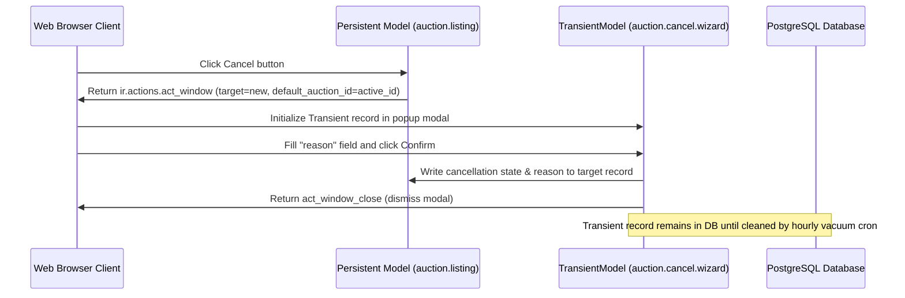

# Wizards & TransientModels: Interactive Modal Dialogs

Wizards are used in Odoo to perform multi-step actions or to gather user input before executing a database modification process. Unlike standard models, wizards do not store data permanently.

---

## 1. What is it
An Odoo Wizard is a temporary, modal window backend model created using `models.TransientModel` instead of `models.Model`. It provides a short-lived view where users input variables, which are then processed by a Python function to update persistent database records.

---

## 2. Why
Standard model records write permanent data. Creating a regular database record just to ask a user a single confirmation question would bloat tables. TransientModels store records temporarily, which Odoo automatically cleans up periodically.

---

## 3. When
*   Use to prompt confirmation inputs (e.g. entering a reason before canceling an auction).
*   Use to guide users through multi-step installation or configuration wizards.
*   Use to configure report filters (date ranges, target accounts) before rendering PDFs.

---

## 4. When Not
*   **Do not** use `TransientModel` to store core business documents (like Invoices or Customers) because their records are periodically deleted by Odoo's vacuum cron.
*   **Do not** use a wizard for simple, single-field updates where inline list edits or form view modifications are faster.

---

## 5. Syntax
Here is the Odoo 19 syntax for declaring a wizard model, its XML form view, and the triggering action:

```python
from odoo import models, fields

# 1. Transient Model
class MyWizard(models.TransientModel):
    _name = 'my.wizard'
    _description = 'My Wizard Description'

    name = fields.Char("Notes")
```

```xml
# 2. Window action opening a popup modal
<record id="action_my_wizard" model="ir.actions.act_window">
    <field name="name">Run Wizard</field>
    <field name="res_model">my.wizard</field>
    <field name="view_mode">form</field>
    <field name="target">new</field> <!-- Required: Opens in a modal popup -->
</record>
```

---

## 6. Examples

### A. The "Cancel Auction" Wizard
This wizard requires users to input a cancellation reason before changing an auction status:

```python
# file: wizard/cancel_auction.py
from odoo import models, fields, api

class AuctionCancelWizard(models.TransientModel):
    _name = 'auction.cancel.wizard'
    _description = 'Cancel Auction Wizard'

    reason = fields.Text(string="Reason for Cancellation", required=True)
    auction_id = fields.Many2one('auction.listing', string="Auction")

    def action_cancel_auction(self):
        self.ensure_one()
        # Write input variables to the persistent record
        self.auction_id.write({
            'state': 'cancelled',
            'cancellation_reason': self.reason
        })
        # Close the modal dialog window
        return {'type': 'ir.actions.act_window_close'}
```

### B. Wizard Form View & Footer Controls
```xml
# file: wizard/cancel_auction_view.xml
<record id="view_auction_cancel_wizard_form" model="ir.ui.view">
    <field name="name">auction.cancel.wizard.form</field>
    <field name="model">auction.cancel.wizard</field>
    <field name="arch" type="xml">
        <form string="Cancel Auction">
            <group>
                <field name="reason" placeholder="e.g. Item damaged during storage..."/>
            </group>
            <footer>
                <!-- Action button calls python method -->
                <button name="action_cancel_auction" string="Confirm" type="object" class="btn-primary"/>
                <!-- Discard button uses special="cancel" to dismiss modal -->
                <button string="Discard" class="btn-secondary" special="cancel"/>
            </footer>
        </form>
    </field>
</record>
```

### C. Trigger Button on Main Listing Form
```xml
<button name="%(action_auction_cancel_wizard)d" 
        string="Cancel Auction" 
        type="action" 
        context="{'default_auction_id': active_id}"
        invisible="state != 'draft'"/>
```

---

## 7. Common Mistakes
1.  **Forgetting `target="new"` in Action definition**: Omitting this parameter causes Odoo to load the wizard form in full-screen mode, replacing the current page context rather than launching it as a popup.
2.  **Referencing Transient records in persistent fields**: Linking a standard `models.Model` record to a `TransientModel` record via a `Many2one` field. When the transient record is vacuumed, the field will hold a broken, dangling database foreign key.

---

## 8. Performance
*   **The Vacuum Cron Job**: Odoo runs a scheduled action every hour (`database_cleanup`) that executes SQL deletion queries on TransientModel tables, purging records older than 1 hour. This ensures database tables remain small and fast.

| Feature | Regular Model (`models.Model`) | Wizard (`models.TransientModel`) |
| :--- | :--- | :--- |
| **Persistence** | Permanent storage in the database. | Temporary storage; records are periodically vacuumed. |
| **Purpose** | Business data (e.g., Sales Orders, Products). | User interaction and temporary state. |
| **Access Rights** | Required for all users. | Usually granted to all authenticated users. |
| **Performance** | Slower (due to indexing/long-term storage). | Very fast (intended for short-lived data). |

---

## 9. Senior
In Odoo 19:
*   Pass active recordset IDs automatically using the context dictionary: `context="{'default_auction_id': active_id}"`. This pre-populates the wizard link before it is rendered to the user.
*   Wizards require security entries inside `ir.model.access.csv` like any other model. Grant read/write permissions to standard user groups to allow dialog initialization.

---

## 10. Diagrams

This sequence diagram illustrates the lifecycle of a wizard popup and how it updates a persistent record before self-terminating:



---

## 11. Related
*   [Form Views](../foundation/views_form.md)
*   [Context & Flags](../env/context.md)
*   [Performance & Set Operations](../search/performance_optimization.md)
