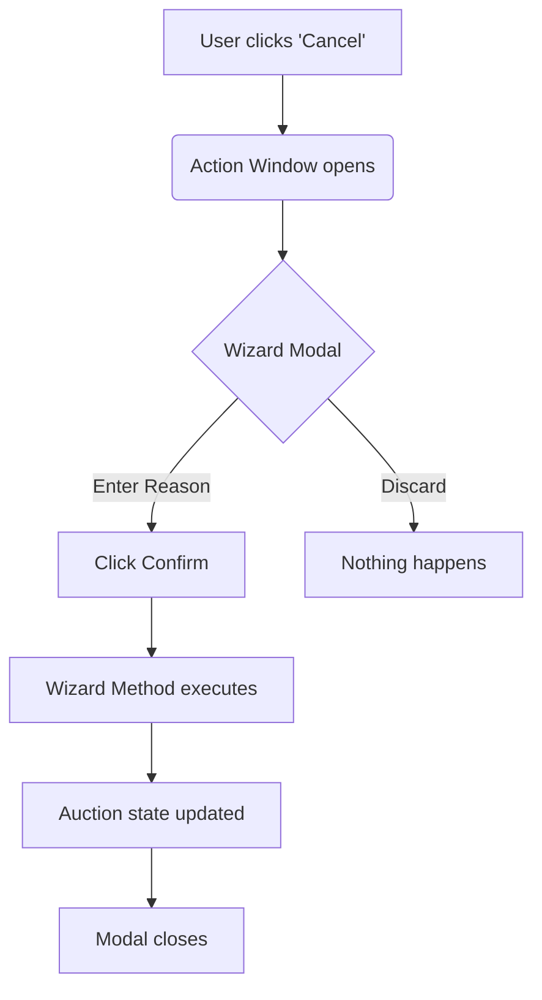

# Wizards & TransientModels

Wizards are used in Odoo to perform multi-step actions or to gather user input before executing a process. Unlike regular models, wizards do not store data permanently.

---

## TransientModels vs Regular Models

In Odoo, wizards are built using `models.TransientModel`. 

| Feature | Regular Model (`models.Model`) | Wizard (`models.TransientModel`) |
| :--- | :--- | :--- |
| **Persistence** | Permanent storage in the database. | Temporary storage; records are periodically vacuumed. |
| **Purpose** | Business data (e.g., Sales Orders, Products). | User interaction and temporary state. |
| **Access Rights** | Required for all users. | Usually granted to all authenticated users. |
| **Performance** | Slower (due to indexing/long-term storage). | Very fast (intended for short-lived data). |

!!! info "Vacuum Cleaning"
    Odoo automatically deletes old TransientModel records from the database every hour (via a cron job), ensuring the database doesn't bloat with temporary wizard data.

---

## Creating a "Cancel Auction" Wizard

Imagine you want to cancel an auction, but you **must** provide a reason. A wizard is the perfect tool for this.

=== "Python (Models)"
    Create a new file `wizard/cancel_auction.py`:
    ```python
    from odoo import models, fields, api

    class AuctionCancelWizard(models.TransientModel):
        _name = 'auction.cancel.wizard'
        _description = 'Cancel Auction Wizard'

        reason = fields.Text(string="Reason for Cancellation", required=True)
        auction_id = fields.Many2one('auction.listing', string="Auction")

        def action_cancel_auction(self):
            self.ensure_one()
            self.auction_id.write({
                'state': 'cancelled',
                'cancellation_reason': self.reason
            })
            return {'type': 'ir.actions.act_window_close'}
    ```

=== "XML (Views)"
    Define the UI in `wizard/cancel_auction_view.xml`:
    ```xml
    <record id="view_auction_cancel_wizard_form" model="ir.ui.view">
        <field name="name">auction.cancel.wizard.form</field>
        <field name="model">auction.cancel.wizard</field>
        <field name="arch" type="xml">
            <form string="Cancel Auction">
                <group>
                    <field name="reason" placeholder="e.g., Suspicious activity..."/>
                </group>
                <footer>
                    <button name="action_cancel_auction" string="Confirm" type="object" class="btn-primary"/>
                    <button string="Discard" class="btn-secondary" special="cancel"/>
                </footer>
            </form>
        </field>
    </record>
    ```

---

## Launching the Wizard from a Button

To trigger this wizard from your main Auction Listing form, you use an `ir.actions.act_window`.

### 1. Define the Action
```xml
<record id="action_auction_cancel_wizard" model="ir.actions.act_window">
    <field name="name">Cancel Auction</field>
    <field name="res_model">auction.cancel.wizard</field>
    <field name="view_mode">form</field>
    <field name="target">new</field> <!-- Opens in a modal/popup -->
</record>
```

### 2. Add the Button to the Form View
```xml
<button name="%(action_auction_cancel_wizard)d" 
        string="Cancel Auction" 
        type="action" 
        context="{'default_auction_id': active_id}"
        invisible="state != 'draft'"/>
```

---

## Wizard Workflow Diagram



!!! tip "Target: New"
    Always set `<field name="target">new</field>` in your window action to ensure the wizard opens as a popup modal instead of a full page.

---

## 🏁 Senior Checkpoint
*   **Key Concept:** `TransientModel` records are temporary and automatically cleaned by Odoo Cron.
*   **Architect Insight:** Wizards are the primary way to collect multi-step input before performing a permanent ORM action.
*   **Verify Your Knowledge:** Why do Wizards not need record rules? (Answer: They do! But often they are restricted to specific groups in ACL).

!!! success "Next Step"
    Wizards collect data. Now learn to [Transform Recordsets](../search/performance_optimization.md) using mapped, filtered, and sorted.

---

<div class="feedback-container">
    <span class="feedback-label">Was this page helpful?</span>
    <div class="feedback-buttons">
        <button class="feedback-btn" onclick="sendFeedback(true)">👍 Yes</button>
        <button class="feedback-btn" onclick="sendFeedback(false)">👎 No</button>
    </div>
</div>
